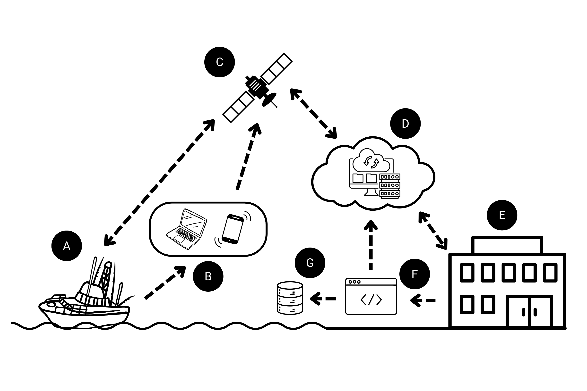

```{r setup, include=FALSE}
# Set global options for code chunks
# New defaults are to not evaluate code, include outputs, include the code, do not include messages or warnings
knitr::opts_chunk$set(echo = TRUE, include=TRUE, message=FALSE, warning=FALSE, eval=FALSE)
```

## Data Workflow

```{r workflow-img, eval=TRUE, echo=FALSE, fig.align = 'center', out.width = "100%", fig.cap = "Diagram depicting the proposed workflow of the Destin Charter Fishermen's Association communications network."}
# (Figure \@ref(fig:workflow-img))

```

*To demonstrate the data workflow of the implementation plan, R [@base] and Shiny [@shiny] will be used for example code. A live version of the example application can be found at [https://cfemm.shinyapps.io/destin-app](https://cfemm.shinyapps.io/destin-app/).*

### A. Network participants record observations at sea

a.  **Network participants:** Professional charter captains from Destin, FL with federal reef fish permits are selected by founding members and subject to non-disclosure agreements. There is a potential pool of \~60 charter and 30-40 commercial permitted vessels active. Nine captains produce \~1,700 trips annually.

b.  **Observations at-sea:** Users record the presence/absence or intensity of depredators and the strength of currents while at sea, which is anticipated to be 10s to 100s of observations per day fleet-wide. Additional observations to record can be phased-in such as discards, metered (YSI) environmental conditions, bait availability, tidelines, obstructions, water clarity, and red-tide.

### B. Data is recorded and mapping products are received via web-based application

a.  **Data recorded:** Recordings take place within a simple app interface (Figure \@ref(fig:ui-img)). for near real-time data entry and viewing, with optional delayed manual entry. Depredation, sharks, dolphins, and current strengths are reported as “none”, “moderate”, or “high”, with their values decided by the user group (e.g. “None”= 0 instances, “Moderate” = 1-3 instances, “High” = 4+ instances). Discards are a possible future addition. “Notes” are optional.

```{r ui-img, eval=TRUE, echo=FALSE, fig.align = 'center', out.width = "100%", fig.cap = "An example user interface for recording observations."}
# (Figure \@ref(fig:ui-img))
knitr::include_graphics("figures/CFA_record_ui.png")
```

b.  **Mapping products:** Real-time fisheries reports are shown as grids/heat maps overlaid on a digital basemap, including selectable environment layers (surface temperature or water clarity; via remote sensing) in the future.

c.  **Web-based application:** Potential platforms/developers are to be determined by network participants. Users are required to register for an account in order to password-protect access to grouped data and display personalized information (user-specific history of recorded point data).

```{r B-c, eval=FALSE}

# B(c). Users must register for an account in order to password-protect access to data.

############ preprocess.R ############
######################################

# Create an example for a fixed userbase and hash the passwords
user_base <- tibble::tibble(
  user = c("cfemm-admin", "test-user"),
  password = purrr::map_chr(c("temp", "hotspots"), sodium::password_store),
  permissions = c("admin", "standard"),
  name = c("Admin Account", "Test User")
)

############ server.R ############
##################################

# Hide the UI until credentials are satisfied
shinyjs::hide(id="main_ui")

# Load the userbase created and initialize the login panel
credentials <- shinyauthr::loginServer(
  id = "login",
  data = user_base,
  user_col = user,
  pwd_col = password,
  sodium_hashed = TRUE,
  log_out = reactive(logout_init())
)

# Initialize the logout panel and listen for logouts
logout_init <- shinyauthr::logoutServer(
  id = "logout",
  active = reactive(credentials()$user_auth)
)

# Use the username as the User ID for recording observations  
observeEvent(credentials()$user_auth, {
  if (credentials()$user_auth) {
    session$userData$user_id <- credentials()$info$user
    # Show UI when logged in
    shinyjs::show(id = "main_ui")  
  } else {
    # Hide UI on logout
    shinyjs::hide(id = "main_ui")
  }
})
```

### C. Satellite communication through Starlink provides internet access

a.  **Starlink communication:** Starlink is integrated with existing onboard networks via wireless router. Users connect to the application through an internet browser on a computer or mobile device. 

### D. A cloud-based server updates the user with maps using a time-slice view

a.  **Integrated maps:** Interactive displays of map data may use platforms such as Google Maps API, Mapbox API, or Leaflet (as exemplified here). The basemap utilizes provider tiles such as the “Esri World Ocean Basemap” to include basic bathymetric visualizations. A geolocation API will display the current location of the vessel. User-specified inputs determine display details for the density rasters or grid polygons. Publicly available environmental data can be integrated as additional layers.

b.  **Time-slice view:** The slider tool enables data filtering from 24 hours to 30 days since the observations were recorded. Data can be weighted to place more “statistical emphasis” on observations that occurred most recently. User-specific point data may “fade” with time since recording.

```{r Step D(c), eval=FALSE}

# D(c). Interactive maps display data
output$examplemap <- renderLeaflet({
    showNotification("Update map in order to view data", duration=20, closeButton=TRUE)
    leaflet() %>%
      addProviderTiles("Esri.NatGeoWorldMap", options = providerTileOptions(minZoom = 5, maxZoom = 10)) %>%
      setView(lng=-86.75, lat=29.75, zoom=9)  %>%
      addScaleBar(position = 'topleft',
                  options = scaleBarOptions(maxWidth = 100, metric = TRUE, imperial = TRUE, updateWhenIdle = FALSE)) 
  })
  
  observeEvent(input$update, {
    
    colors <- c("#00a65a", "#f39c12", "#dd4b39")
    pro_levels <- c("None", "Moderate", "High")
    pro_pal <- colorFactor(colors, levels=pro_levels, domain=c("None", "Moderate", "High"))
    popper <- paste0("<strong>Notes: </strong>observer data")
    poppy <- paste0("<strong>Notes: </strong>", gridvalues_u()$all_notes)
    
    proxy <- leafletProxy("examplemap")
      
    proxy %>% 
      clearHeatmap() %>%
      clearShapes() %>%
      clearImages() %>%
      clearControls() %>%
      leafem::addMouseCoordinates() %>%
      addMarkers(lng=-86.3,
                 lat=30.25, icon=boat_icon) %>%
      addSimpleGraticule(interval = 1, 
                         group = "Graticule") %>%
      addControl(html=html_legend, position="topright") %>%
      addLayersControl(position="topleft", overlayGroups = c("Graticule"), 
                       options=layersControlOptions(collapsed=FALSE))
    
    if (input$radio_depred == "Total" & input$radio_layer == "Intensity (grid)"){
    proxy %>%
      addPolygons(data = gridvalues(),
                  fillColor = ~pro_pal(depred_class),
                  weight = 0.5,
                  color = "black",
                  fillOpacity = 1,
                  highlightOptions = highlightOptions(color = "white", weight = 2, bringToFront = TRUE),
                  popup = ~popper,
                  group = "Depredation Intensity") %>%
        addPolygons(data = gridvalues_u(),
                    fillColor = ~pro_pal(depred_class),
                    weight = 0.5,
                    color = "black",
                    fillOpacity = 1,
                    highlightOptions = highlightOptions(color = "white", weight = 2, bringToFront = TRUE),
                    popup = ~poppy,
                    group = "Depredation Intensity") %>%
        leaflet::addLegend(position = 'topright',
                           pal = pro_pal,
                           values = c("None", "Moderate", "High"),
                           opacity = 1,
                           title = HTML("Depredation<br>Intensity"),
                           group = "Depredation Intensity",
                           layerId = "Depredation Intensity") 
    }  
      
    if (input$radio_depred == "Total" & input$radio_layer == "Density (heat)"){
    proxy %>% 
      addHeatmap(data = all_centroids() %>% filter(depred_class != "None"),
        intensity = ~num_points,
        blur = 35,
        radius = 30,
        group = "Catch Density")
    }  
    
    if (input$radio_depred == "Sharks" & input$radio_layer == "Intensity (grid)"){
      proxy %>%
        addPolygons(data = gridvalues(),
                    fillColor = ~pro_pal(sharks_class),
                    weight = 0.5,
                    color = "black",
                    fillOpacity = 1,
                    highlightOptions = highlightOptions(color = "white", weight = 2, bringToFront = TRUE),
                    popup = ~popper,
                    group = "Shark Intensity") %>%
        addPolygons(data = gridvalues_u(),
                    fillColor = ~pro_pal(sharks_class),
                    weight = 0.5,
                    color = "black",
                    fillOpacity = 1,
                    highlightOptions = highlightOptions(color = "white", weight = 2, bringToFront = TRUE),
                    popup = ~poppy,
                    group = "Shark Intensity") %>%
        leaflet::addLegend(position = 'topright',
                           pal = pro_pal,
                           values = c("None", "Moderate", "High"),
                           opacity = 1,
                           title = HTML("Shark Intensity"),
                           group = "Shark Intensity",
                           layerId = "Shark Intensity") 
    }
    
    if (input$radio_depred == "Sharks" & input$radio_layer == "Density (heat)"){
      proxy %>% 
        addHeatmap(data = all_centroids() %>% filter(sharks_class != "None"),
                   intensity = ~num_points,
                   blur = 35,
                   radius = 30,
                   group = "Shark Density")
    } 
    
    if (input$radio_depred == "Dolphins" & input$radio_layer == "Intensity (grid)"){
      proxy %>%
        addPolygons(data = gridvalues(),
                    fillColor = ~pro_pal(dolphins_class),
                    weight = 0.5,
                    color = "black",
                    fillOpacity = 1,
                    highlightOptions = highlightOptions(color = "white", weight = 2, bringToFront = TRUE),
                    popup = ~popper,
                    group = "Dolphin Intensity") %>%
        addPolygons(data = gridvalues_u(),
                    fillColor = ~pro_pal(dolphins_class),
                    weight = 0.5,
                    color = "black",
                    fillOpacity = 1,
                    highlightOptions = highlightOptions(color = "white", weight = 2, bringToFront = TRUE),
                    popup = ~poppy,
                    group = "Dolphin Intensity") %>%
        leaflet::addLegend(position = 'topright',
                           pal = pro_pal,
                           values = c("None", "Moderate", "High"),
                           opacity = 1,
                           title = HTML("Dolphin Intensity"),
                           group = "Dolphin Intensity",
                           layerId = "Dolphin Intensity") 
    }
    
    if (input$radio_depred == "Dolphins" & input$radio_layer == "Density (heat)"){
      proxy %>% 
        addHeatmap(data = all_centroids() %>% filter(dolphins_class != "None"),
                   intensity = ~num_points,
                   blur = 35,
                   radius = 30,
                   group = "Dolphin Density")
    }
    
    if (input$radio_current == "Yes"){
      proxy %>%
        clearHeatmap() %>%
        clearControls() %>%
        addControl(html=html_legend, position="topright") %>%
        addPolygons(
          data=gridvalues(),
          fillColor = ~pro_pal(current_class),
          weight = 0.5,
          color = "black",
          fillOpacity = 1,
          highlightOptions = highlightOptions(color = "white", weight = 2, bringToFront = TRUE),
          popup = ~popper,
          group = "Current Intensity") %>%
        addPolygons(data = gridvalues_u(),
                    fillColor = ~pro_pal(current_class),
                    weight = 0.5,
                    color = "black",
                    fillOpacity = 1,
                    highlightOptions = highlightOptions(color = "white", weight = 2, bringToFront = TRUE),
                    popup = ~poppy,
                    group = "Current Intensity") %>%
        leaflet::addLegend(position = 'topright',
                           pal = pro_pal,
                           values = c("None", "Moderate", "High"),
                           opacity = 1,
                           title = HTML("Current Intensity"),
                           group = "Current Intensity",
                           layerId = "Current Intensity")
    }
      
  })

```

### E. Gulf Fisheries Research Foundation (GFRF) serves as the institutional home for the implementation plan

a.  **Institutional home:** GFRF is the research arm of the Charter Fishermen’s Association (CFA) and can provide an administrative and managerial role for other local CFA networks.

b.  **Implementation plan:** The plan includes membership information, Starlink subscriptions, database management, and server/code updates for the web application.

### F. Code cleans inputs and processes raw data for integration into grid cells or heatmaps

a.  **Cleans inputs:** Code parses date-time and lat-long data into a consistent format. Manual entry is restricted to feasible dates and ranges by utilizing error-handling pop-up messages.

b.  **Data processing:** Depredation and current strength observations (“None”, “Moderate”, or “High”) are translated into numerical inputs. Points within a 1-sq mile grid cell are averaged to determine a ‘stoplight color’ classification of the cell to depict areas to avoid or target (Figure \@ref(fig:grid-img)). Heat maps are developed by filtering the data by the user’s input, computing an appropriate bandwidth, followed by a 2D binned kernel density estimate which is converted to a raster for visualizing high (warm colors) or low (cool colors) point density (Figure \@ref(fig:heat-img)). Computations would be made on network-wide observations (not for current strength), but users may only view their own recorded data points.

```{r grid-img, eval=TRUE, echo=FALSE, fig.align = 'center', out.width = "100%", fig.cap = "Example map displaying depredation intensity in 1 mi by 1 mi grid cells."}
# (Figure \@ref(fig:grid-img))
knitr::include_graphics("figures/CFA_grid_map.png")
```

```{r heat-img, eval=TRUE, echo=FALSE, fig.align = 'center', out.width = "100%", fig.cap = "Example heat map displaying density of depredation events."}
# (Figure \@ref(fig:heat-img))
knitr::include_graphics("figures/CFA_heat_map.png")
```

c.  **Mapping:** Maps are reactive to additional observations recorded, and any filters that the user defines (e.g. time slider, depredation vs current, etc.). Grid or heat map display may be toggled depending on user preference (Figure \@ref(fig:filter-img)). User-specific point data may also be viewed on the "User Data" page. Users can select grid cells or point data to view details, “Notes” recorded, or obtain coordinates from the map by mousing-over it.

```{r filter-img, eval=TRUE, echo=FALSE, fig.align = 'center', out.width = "25%", fig.cap = "User input options available to display layers on the main map."}
# (Figure \@ref(fig:filter-img))
knitr::include_graphics("figures/CFA_ui_inputs.png")
```

### G. Data is stored for future analysis on long-term trends and predictive modeling

a.  **Data storage:** Each observation recorded has an observation ID, user ID, and timestamp that is appended at the time of entry and uploaded to the master database. The data is stored in a cloud-based relational database, such as MySQL or SQL Server, in order to maintain security, scalability, and speed (Google Sheets is utilized in this example). All data is accessible to GFRF, grouped data are accessible to all users, and user-specific data is only accessible to the specified user (Figure \@ref(fig:table-img)).

```{r table-img, eval=TRUE, echo=FALSE, fig.align = 'center', out.width = "100%", fig.cap = "User-specific information is recorded at the time of observation and only made available to the specified user."}
# (Figure \@ref(fig:table-img))
knitr::include_graphics("figures/CFA_user_table.png")
```

b.  **Future analyses:** Long-term trends (e.g. GAMs) and predictive modeling based on network-reported data may be updated on a rolling basis as determined by GFRF. Results could be sent as alerts by email or text to users on areas to avoid within a certain time frame. There is potential for the use of data recorded by the participants in reports to NMFS for electronic logbook, stock assessments, etc.

## Full Code

### Directory Organization

The file structure for this application is as follows:

```
└── 📁app
    └── 📁.secrets
        └── secret-token
    └── 📁data
        └── Oceanic_current_speed.csv
        └── preprocess.RData                              
    └── 📁shapefiles
        └── destin_1mi.cpg
        └── destin_1mi.dbf
        └── destin_1mi.prj
        └── destin_1mi.sbn
        └── destin_1mi.sbx
        └── destin_1mi.shp
        └── destin_1mi.shp.xml
        └── destin_1mi.shx
    └── 📁www
        └── boat.svg
        └── cfa-logo.png
    └── global.R
    └── preprocess.R
    └── server.R
    └── ui.R
```

### Limitations

Importantly, the example application is currently incapable of performing two critical functions:

1. The app cannot utilize georeferencing to determine the user's location which is needed for updating the map's location marker and automatically assigning coordinates to newly recorded observations.

2. Users are unable to modify or delete recorded observations once submitted to the database. The administrator must manually service these requests.

### preprocess.R

```{r preprocess}
# This script preprocesses data needed in the server and user interface. 

# Load packages for preprocessing
{
  library(tidyverse)
  library(data.table)
  library(lubridate)
  library(sf)
  library(leaflet)
  library(googledrive)
  library(googlesheets4)
  library(digest)
}

{
# Set global options for handling Google Sheets token
options(
  gargle_oauth_email=TRUE,
  gargle_oauth_cache = "/.secrets",
  gargle_oauth_path = NULL
)

# To be done once upon initializing the desired Google Sheet
# gs4_create(name="cfa-test-sheet",
#            sheets="main")

# Assign Google Sheet ID
sheet_id <- drive_get("cfa-test-sheet")$id

# Read NOAA Observer data and format columns
Data.In <- fread("destin-app/data/NOAA-Observer-data.csv")
{noaa_data=Data.In
noaa_data <- noaa_data %>% dplyr::filter(COMMON_NAME != "" | SET_TIME_START != "") #| VESSEL_ID != "")
noaa_data$SET_TIME_START_dt <- parse_date_time(noaa_data$SET_TIME_START, "d-b-y I.M.S.p")
noaa_data$SET_TIME_END_dt <- parse_date_time(noaa_data$SET_TIME_END, "d-b-y I.M.S.p")
noaa_data$DEPART_DATE_dt <- mdy(noaa_data$DEPART_DATE)
noaa_data$LAND_DATE_dt <- mdy(noaa_data$LAND_DATE)
noaa_data$SET_YEAR <- year(noaa_data$SET_TIME_START_dt)
noaa_data$SEA_DAYS <- as.numeric(difftime(noaa_data$LAND_DATE_dt, noaa_data$DEPART_DATE_dt, units = "days"))
}

# Function to generate random alphanumeric string of the same length
random_string <- function(n) {
  paste(sample(c(0:9, letters, LETTERS), n, replace = TRUE), collapse = "")
}

# Create a function to map unique values to random strings
random_mask <- function(column) {
  # Get unique values in the column
  unique_values <- unique(column)
  
  # Generate random strings for each unique value, with the same length as the original value
  masked_values <- sapply(nchar(unique_values), random_string)
  
  # Create a mapping table (dictionary)
  value_map <- setNames(masked_values, unique_values)
  
  # Replace the original values with their masked versions
  return(value_map[column])
}

# Mask columns with sensitive information
{noaa_data$VESSEL_ID <- random_mask(noaa_data$VESSEL_ID)
noaa_data$TRIPNUMBER <- random_mask(noaa_data$TRIPNUMBER)
noaa_data$UNIQUE_RETRIEVAL <- paste(noaa_data$VESSEL_ID, noaa_data$TRIPNUMBER, noaa_data$SETNUMBER, sep="_")
}

# Filter NOAA observer data for vertical line gear near Destin
noaa_vl_des <- noaa_data %>%
  filter(TRIP_GEAR == 'VL' & COMMON_NAME != "NOCATCH" & LON_BEGIN_SET > -89 & LAT_BEGIN_SET > 29 & !is.na(SET_TIME_START)) %>%
  mutate(Effort_ID = dense_rank(TRIPNUMBER)) %>%
  group_by(TRIPNUMBER) %>%
  mutate(Days_Report = dense_rank(as.Date(SET_DATE, format="%m/%d/%Y"))) %>%
  ungroup()

# Load shapefile for 1mi by 1mi grid
gridshp <- st_read(dsn="shapefiles", layer = "destin_1mi")

# Determine bounding box for shapefile limits
bbox <- st_bbox(gridshp)

# Create icon for boat and make static legend
boat_icon <- makeIcon(iconUrl = "www/boat2.svg",
                      iconWidth=35, iconHeight=30, 
                      iconAnchorX=15, iconAnchorY=15)
html_legend <- " Current Location<br/>"

# Read historic current speed data
current_speed <- fread("destin-app/data/Oceanic_current_speed.csv") %>%
  dplyr::select(Longitude, Latitude, Oceanic_current_speed_October) %>%
  rename("Speed_Oct" = "Oceanic_current_speed_October")

# Convert the current speed data frame to a spatial object
current_speed_sf <- st_as_sf(current_speed, coords = c("Longitude", "Latitude"), crs = st_crs(gridshp))

# Perform the spatial join for current speed data and grid
grid_join_c <- setDT(st_join(current_speed_sf, gridshp, join = st_intersects))

# Assign bins to current speed data
filtered_data_c <- grid_join_c %>%
    group_by(GRID_ID) %>%
    summarise(
      speed_mean = mean(Speed_Oct, na.rm = TRUE)
    ) %>%
  mutate(class_bin = case_when(
    speed_mean >= 0.5 ~ 3,
    speed_mean >= 0.3 ~ 2,
    speed_mean < 0.3 ~ 1
  ))

# Determine grid values for current speed data
gridvalues_c <- st_as_sf(merge(x = gridshp, y = filtered_data_c, by = "GRID_ID", all.x = FALSE))

# create an example for a fixed userbase and hash the passwords
user_base <- tibble::tibble(
  user = c("cfemm-admin", "test-user"),
  password = purrr::map_chr(c("temp", "hotspots"), sodium::password_store),
  permissions = c("admin", "standard"),
  name = c("Admin Account", "Test User")
)

# Save variables for use in the server
save(gridshp, sheet_id, noaa_data, noaa_vl_des, boat_icon, html_legend, user_base, file = "destin-app/data/preprocess.RData")
}
```

### global.R

```{r global}
# This script loads data and packages needed in the server and user interface.

# Load packages for the entire app
{
  library(tidyverse)
  library(data.table)
  library(lubridate)
  library(spatial)
  library(sp)
  library(sf)
  library(spdep)
  library(sfdep)
  library(fields)
  library(RColorBrewer)
  library(leaflet)
  library(kableExtra)
  library(shiny)
  library(plotly)
  library(htmlwidgets)
  library(shinyWidgets)
  library(shinycustomloader)
  library(leaflet.extras)
  library(leaflet.extras2)
  library(leafem)
  library(DT)
  library(shinydashboard)
  library(googledrive)
  library(googlesheets4)
  library(digest)
  library(shinyauthr)
  library(sodium)
}

# Load data made in the preprocessing file
load("preprocess.RData")

# Set Google sheet information
googledrive::drive_auth(cache = ".secrets", email = "example@email.com")
googlesheets4::gs4_auth(token = drive_token())
```

### server.R

```{r server}
# server.R

```

### ui.R

```{r ui}
# This script builds the user interface.

dashboardPage(skin="black", 
  dashboardHeader(
    title = div(img(src="cfa-logo.png", style = "width:50px;height:50px"), "Charter Fisherman's Association"),
    titleWidth = 400,
    tags$li(class = "dropdown", shinyauthr::logoutUI(id = "logout"), style="margin-right:15px; margin-top:10px;")
  ), # dashboard header
  dashboardSidebar(
    width = 400,
    sidebarMenu(id="sidebarid", style="white-space: normal;",
      menuItem("Map", tabName="maptab", icon=icon("map")),
      menuItem("Record New Observation", tabName="recordtab", icon=icon("pen-to-square")),
      menuItem("User Data", tabName="usertab", icon=icon("user")),
      conditionalPanel(
        'input.sidebarid == "maptab"',
        sliderTextInput("days", "Days Since Reporting", choices=seq(from=1, to=14, by=1), selected=c(3), grid=TRUE),
        radioGroupButtons("radio_current", "Display Current Intensity", choices = c("Yes", "No"), selected="No"),
        conditionalPanel("input.radio_current == 'No'",
          radioGroupButtons("radio_depred", "Display Depredation", choices=c("Total", "Sharks", "Dolphins"), selected="Total"),
          radioGroupButtons("radio_layer", "Layer Style", choices=c("Intensity (grid)", "Density (heat)"), selected="Intensity (grid)"),
        ),
        actionButton("update", "Update Map", icon=icon("refresh"), class="btn btn-primary", style = "color: white;")
      ), # conditional panel - map tab
      conditionalPanel(
        'input.sidebarid == "usertab"',
        radioGroupButtons("radio_points", "Display Layer", choices = c("Species Encountered", "Depredation Intensity", "Current Intensity"), selected="Species Encountered", direction="vertical")
      ) # conditional panel - user tab
    ) # sidebar menu
  ), # dashboard sidebar
  dashboardBody(
    shinyauthr::loginUI("login"),
    div(id="main_ui",
    tabItems(
      tabItem(tabName="maptab",
        fluidRow(
          box(
            width=8, status="primary", 
            HTML("ABOUT THE DATA<br>Displayed is a combination of data collected via the NOAA Observer Program and manually recorded observations.
              The total number of observations refers to the number of points informing the map. Grid cells are 1 mi by 1 mi and reflect the average
              value of points located inside each cell. Current intensity was calculated using averages of the current speed (m/s) from 2000-2017
              during the month of October.")),
          infoBoxOutput("text_obs", width=4),
        ), # fluid row
        fluidRow(
          box(
            width=12, title = "Map", status="primary", solidHeader=TRUE, collapsible=FALSE,
            withLoader(leafletOutput("examplemap", height = 740), type="html", loader="loader4")
          ) # box - map
        ) # fluid row
      ), #tab item
      tabItem(tabName="recordtab",
        fluidRow(
        box(width=12, status="primary", title="Record New Observation", solidHeader=TRUE,
          helpText("Please enter your observations using the following inputs."),
          fluidRow(
            column(width=4, pickerInput("select_current", label = "Current Intensity", choices = c("None", "Moderate", "High"), selected = "None",
                   choicesOpt = list(
                                    content = sprintf("<span class='label label-%s'>%s</span>",
                                                      c("success", "warning", "danger"),
                                                      c("None", "Moderate", "High"))
            ))),
            column(width=4, pickerInput("select_depred", label = "Depredation Intensity", choices = c("None", "Moderate", "High"), selected = "None",
                                              choicesOpt = list(
                                                content = sprintf("<span class='label label-%s'>%s</span>",
                                                                  c("success", "warning", "danger"),
                                                                  c("None", "Moderate", "High"))
            ))),
            column(width=4, pickerInput("select_species", label = "Species Encountered", choices = c("None","Shark", "Dolphin"), selected = "None",
                                              choicesOpt = list(
                                                content = sprintf("<span class='label label-%s'>%s</span>",
                                                                  c("success", "primary", "info"),
                                                                  c("None", "Shark", "Dolphin"))
            )))
          ), # fluid row
          fluidRow(
            column(width=4, radioButtons("check_loc", label = "Use Current Location", c("Yes", "No"), selected = "Yes")),
            column(width=4, conditionalPanel(condition="input.check_loc == 'No'",
                                              textInput("text_long", label = "Longitude"))),
            column(width=4, conditionalPanel(condition="input.check_loc == 'No'",
                                              textInput("text_lat", label = "Latitude")))
          ), # fluid row
          fluidRow(
            column(width=8, textInput("text_notes", label="Notes"))
          ), # fluid row
          actionButton("submit", "Submit Data", class="btn btn-primary", style = "color: white;")
        ) # box
        ) # fluid row
      ), # tab item
      tabItem(tabName="usertab",
        fluidRow(
        box(
          width=12, title="User Data", status="primary", solidHeader=TRUE, collapsible=TRUE,
          div(DTOutput("user_data"), style="overflow-y: auto; height=300px")
        ) # box - table
        ),
        fluidRow(
        box(
          width=12, title = "Map", status="primary", solidHeader=TRUE, collapsible=TRUE, 
          withLoader(leafletOutput("user_map", height = 540), type="html", loader="loader4")
        ) # box - user map
        ) # fluid row
      ) # tab item
    ) # tab items
    ) # div main ui 
  ) # dashboard body
) # dashboard page  
```

## References
