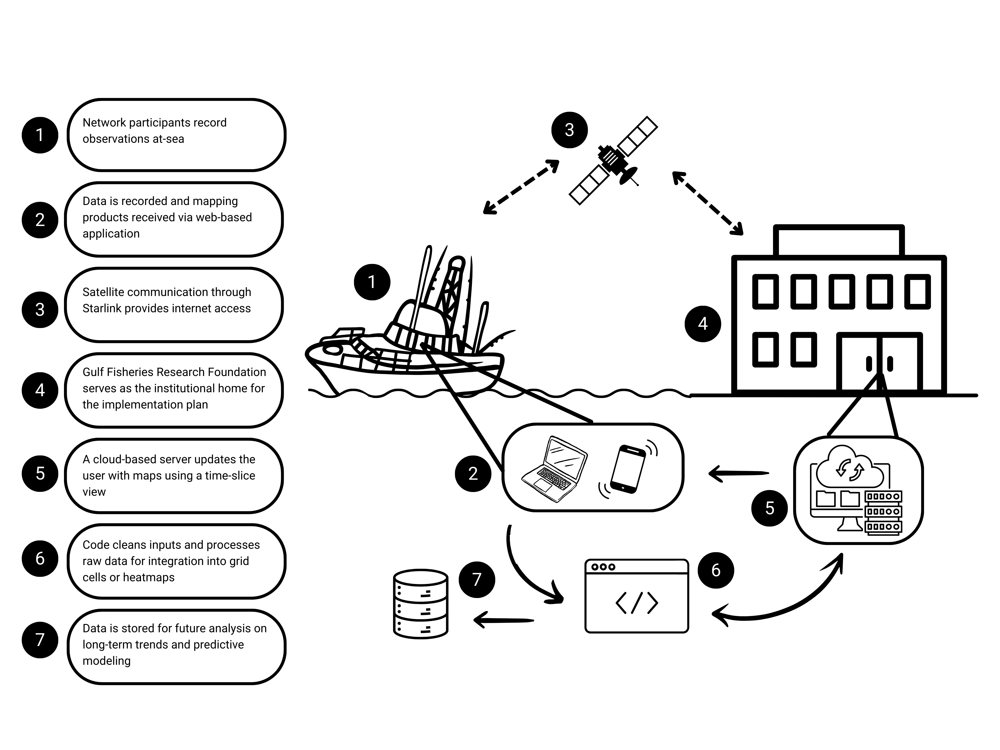

```{r setup, include=FALSE} 
# Set global options for code chunks
# New defaults are to evaluate code, include outputs, include the code, do not include messages or warnings
knitr::opts_chunk$set(echo = TRUE, include=TRUE, message=FALSE, warning=FALSE)
```

## Data Workflow

{width=100%}
Figure 1. Diagram depicting the proposed workflow of the Destin Charter Fishermen's Association communications network.

*To demonstrate the data workflow of the implementation plan, R and Shiny will be used for example code.*

1. **Network participants record observations at sea**
    a. **Network participants:** Professional charter captains from Destin, FL with federal reef fish permits are selected by founding members and subject to non-disclosure agreements. There is a potential pool of ~60 charter and 30-40 commercial permitted vessels active. Nine captains produce ~1,700 trips annually.
    b. **Observations at-sea:** Initially, users record the presence/absence of depredators and the strength of currents. Additional observations to record can be phased-in, such as discards, metered (YSI) environmental conditions, bait availability, tidelines, obstructions, water clarity, and red-tide.


2. **Data is recorded and mapping products are received via web-based application**
    a. **Data recorded:** Recordings take place within a simple app interface (e.g. Figure 2) for near-real time data entry and viewing, with optional delayed manual entry. Sharks, dolphins, and current strengths are reported as “none”, “moderate”, or “high”., with their values decided by the user group (e.g. “None”= 0, “Moderate” = 1-3 instances, “High” = 4+ instances). Discards are a possible future addition. “Notes” are optional.
    b. **Mapping products:** Real-time fisheries reports are shown as grids/heat maps overlaid on a digital basemap, including selectable environment layers (surface temperature or water clarity; via remote sensing) in the future.
    c. **Web-based application:** Potential platforms/developers to be determined by network participants. The website requires a user to register for an account in order to password-protect access to the grouped data as well as display personalized information, a history of recorded observations, and point data that is user-specific. The app must be scalable in order to maintain performance while under an increased load. Participants are estimated to record tens to hundreds of observations per day.

```{r Step 2(a), eval=FALSE}

# 2(a). Data is recorded through simple inputs
selectInput("current_input", label = "Current Intensity", choices = c("None", "Moderate", "High"), selected = "None")
selectInput("dep_input", label = "Depredation Intensity", choices = c("None", "Moderate", "High"), selected = "None")
selectInput("species_input", label = "Species Encountered", choices = c("None", "Moderate", "High"), selected = "None")

```

3. **Satellite communication through Starlink provides internet access**
    a. **Starlink communication:** Starlink is integrated with existing onboard networks via direct ethernet connection or included Wi-Fi router. Users connect to the application via an internet browser on a computer or mobile device.


4. **Gulf Fisheries Research Foundation (GFRF) serves as the institutional home for the implementation plan**
    a. **Institutional home:** GFRF is the research arm of the Charter Fishermen’s Association (CFA) and can provide an administrative and managerial role for other local CFA networks.
    b. **Implementation plan:** The plan includes membership information, Starlink subscriptions, database management, and server/code updates for the web application.


5. **A cloud-based server updates the user with maps using a time-slice view**
    a. **Cleans inputs:** Code parses date-time and lat-long data into a consistent format. Manual entry is restricted to feasible dates and ranges by utilizing error-handling pop-up messages.
    b. **Data processing:** Depredation and current strength observations (“None”, “Moderate”, or “High”) are translated into numerical inputs (1, 2, or 3, respectively) and the points averaged within a 1-sq mile grid cell are averaged in order to determine the classification of the cells. Each classification corresponds with a color in a stoplight to depict areas to avoid or target (e.g. Current strength = “None” is green, “Moderate” is yellow, and “High is red), as seen in Figure 2. Heat maps are developed by filtering the data by the user’s input, computing an appropriate bandwidth, followed by a 2D binned kernel density estimate, which is then converted to a raster for visualization. Areas with a higher point density are depicted by warmer colors, while areas of lower density are depicted by cooler colors, as seen in Figure 3. Point density would not be calculated for current strength. Additionally, The grouped points used for computations are unavailable for viewing by the user, however users can view their own recorded observations separately from the grouped data.. using XXXX. Output as XXX for long-term storage (7)
    c. **Map integration:** Leaflet, or another platform such as Google Maps API,  is used for interactive displays of map data. The basemap utilizes provider tiles such as the “Esri National Geographic Style Basemap” or the “Esri World Ocean Basemap” to include basic bathymetric visualizations. The map also displays the relative current location of the vessel using a geolocation API. Layers for the density rasters and grid polygons are reactive to user-specified inputs (e.g. species to display, time period to view) are displayed when toggled. The user can obtain coordinates from the map by mousing-over it. Spatial linkage for grid performed with XXXX. Heatmap display uses XXXX. Publically available environmental data processed by XXX.
    d. **Depredation model:** Network-reported depredation modeled with environmental data updated on rolling basis - FUTURE OPTION or ACTION ITEM?
    
``` {r Step 5(c)}

library(tidyverse)
library(leaflet)

# 5(c). Interactive maps display data
leaflet() %>%
  addProviderTiles("Esri.NatGeoWorldMap", group = "Basemap") %>%
  setView(lng=-86.5, lat=30.2, zoom=10) %>%
  addScaleBar(position = 'topleft', options = scaleBarOptions(maxWidth = 100, metric = TRUE, imperial = TRUE, updateWhenIdle = TRUE))

```

6. **Code cleans inputs and processes raw data for integration into grid cells or heatmaps**
    a. **Maps:** Maps are reactive to additional observations recorded, and any filters that the user defines (e.g. time slider, depredation vs current, etc.). Grid or heat map display is dependent on user preference and can be toggled with a radio button. Users can also select one or more grid cells to view any “Notes” that have been recorded in that area. Additionally, user-specific point data can be toggled on/off.
    b. **Time-slice view:** The slider tool enables data filtering from 24 hours to 30 days since the observations were recorded. Data can be weighted to place more “statistical emphasis” on observations that occurred most recently. User-specific point data, that is only viewable by that user, “fades” with time since recording.  Data weighting?


7. **Data is stored for future analysis on long-term trends and predictive modeling**
    a. **Data storage:** Each observation recorded has an observation ID, user ID, and timestamp that is appended at the time of entry and uploaded to the master database. The data is stored in a cloud-based relational database, such as MySQL or SQL Server, in order to maintain security, scalability, and speed. All data is accessible to GFRF, grouped data (grids and density) are accessible to all users, and user-specific data is only accessible to the specified user. DETAILS ON STORAGE OPTIONS or FORMATS? Can Access handle the projected number of data points over time?
    b. **Future analyses:** Long-term trends (e.g. GAMs) and predictive modeling could be used to send alerts by email or text to users on areas to avoid within a certain time frame. There is potential for the use of data recorded by the participants in reports to NMFS for electronic logbook, stock assessments, etc.

