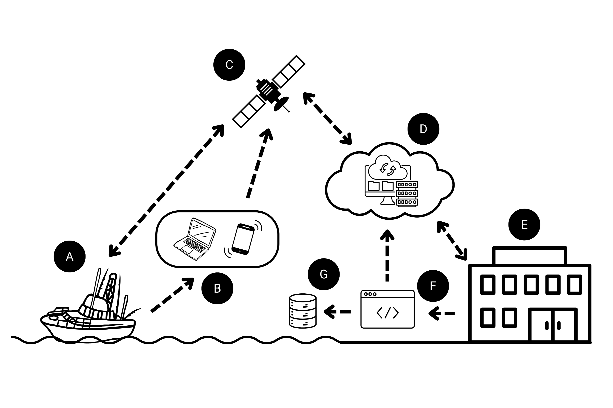

```{r setup, include=FALSE}
# Set global options for code chunks
# New defaults are to evaluate code, include outputs, include the code, do not include messages or warnings
knitr::opts_chunk$set(echo = TRUE, include=TRUE, message=FALSE, warning=FALSE)
```

## Data Workflow

{width="100%"}

Figure 1. Diagram depicting the proposed workflow of the Destin Charter Fishermen's Association communications network.

*To demonstrate the data workflow of the implementation plan, R [@base] and Shiny [@shiny] will be used for example code.*

A. **Network participants record observations at sea**

a.  **Network participants:** Professional charter captains from Destin, FL with federal reef fish permits are selected by founding members and subject to non-disclosure agreements. There is a potential pool of \~60 charter and 30-40 commercial permitted vessels active. Nine captains produce \~1,700 trips annually.

b.  **Observations at-sea:** Users record the presence/absence or intensity of depredators and the strength of currents while at sea, which is anticipated to be 10s to 100s of observations per day fleet-wide. Additional observations to record can be phased-in such as discards, metered (YSI) environmental conditions, bait availability, tidelines, obstructions, water clarity, and red-tide.

{width="100%"}

Figure 2. Screenshot of an example user interface for recording observations.

B. **Data is recorded and mapping products are received via web-based application**

a.  **Data recorded:** Recordings take place within a simple app interface (e.g. Figure 2) for near real-time data entry and viewing, with optional delayed manual entry. Depredation, sharks, dolphins, and current strengths are reported as “none”, “moderate”, or “high”, with their values decided by the user group (e.g. “None”= 0 instances, “Moderate” = 1-3 instances, “High” = 4+ instances). Discards are a possible future addition. “Notes” are optional.

b.  **Mapping products:** Real-time fisheries reports are shown as grids/heat maps overlaid on a digital basemap, including selectable environment layers (surface temperature or water clarity; via remote sensing) in the future.

c.  **Web-based application:** Potential platforms/developers are to be determined by network participants. Users are required to register for an account in order to password-protect access to grouped data and display personalized information (user-specific history of recorded point data).

```{r Step B(a), eval=FALSE}

# B(a). Data is recorded through simple inputs as seen in Figure 2.
tabPanel("Record New Observation",
  wellPanel(
    helpText("Please enter your observations using the following inputs."),
    fluidRow(
      column(width=4, selectInput("select_current", label = "Current Intensity", choices = c("None", "Moderate", "High"), selected = "None")),
      column(width=4, selectInput("select_depred", label = "Depredation Intensity", choices = c("None", "Moderate", "High"), selected = "None")),
      column(width=4, selectInput("select_species", label = "Species Encountered", choices = c("None","Shark", "Dolphin"), selected = "None"))
    ),
    fluidRow(
      column(width=4, radioButtons("check_loc", label = "Use Current Location", c("Yes", "No"), selected = "Yes")),
      column(width=4, textInput("text_lat", label = "Latitude")),
      column(width=4, textInput("text_long", label = "Longitude"))
    ), 
    fluidRow(
      column(width=8, textInput("text_notes", label="Notes"))
    ),
    actionButton("submit", "Submit Data")
  )
)

```

C. **Satellite communication through Starlink provides internet access**

a.  **Starlink communication:** Starlink is integrated with existing onboard networks via wireless router. Users connect to the application through an internet browser on a computer or mobile device. 

D. **A cloud-based server updates the user with maps using a time-slice view**

a.  **Integrated maps:** Interactive displays of map data may use platforms such as Google Maps API, Mapbox API, or Leaflet (as exemplified here). The basemap utilizes provider tiles such as the “Esri World Ocean Basemap” to include basic bathymetric visualizations. A geolocation API will display the current location of the vessel. User-specified inputs determine display details for the density rasters or grid polygons. Publicly available environmental data can be integrated as additional layers.

b.  **Time-slice view:** The slider tool enables data filtering from 24 hours to 30 days since the observations were recorded. Data can be weighted to place more “statistical emphasis” on observations that occurred most recently. User-specific point data may “fade” with time since recording.

```{r Step D(c)}

library(tidyverse)
library(leaflet)

# D(c). Interactive maps display data
leaflet() %>%
  addProviderTiles("Esri.NatGeoWorldMap", group = "Basemap") %>%
  setView(lng=-86.5, lat=30.2, zoom=10) %>%
  addScaleBar(position = 'topleft', options = scaleBarOptions(maxWidth = 100, metric = TRUE, imperial = TRUE, updateWhenIdle = TRUE))

```

E. **Gulf Fisheries Research Foundation (GFRF) serves as the institutional home for the implementation plan**

a.  **Institutional home:** GFRF is the research arm of the Charter Fishermen’s Association (CFA) and can provide an administrative and managerial role for other local CFA networks.

b.  **Implementation plan:** The plan includes membership information, Starlink subscriptions, database management, and server/code updates for the web application.

F. **Code cleans inputs and processes raw data for integration into grid cells or heatmaps**

a.  **Cleans inputs:** Code parses date-time and lat-long data into a consistent format. Manual entry is restricted to feasible dates and ranges by utilizing error-handling pop-up messages.

b.  **Data processing:** Depredation and current strength observations (“None”, “Moderate”, or “High”) are translated into numerical inputs. Points within a 1-sq mile grid cell are averaged to determine a ‘stoplight color’ classification of the cell to depict areas to avoid or target (e.g. Figure 1). Heat maps are developed by filtering the data by the user’s input, computing an appropriate bandwidth, followed by a 2D binned kernel density estimate which is converted to a raster for visualizing high (warm colors) or low (cool colors) point density (e.g. Figure 2). Computations would be made on network-wide observations (not for current strength), but users may only view their own recorded data points.

c.  **Mapping:** Maps are reactive to additional observations recorded, and any filters that the user defines (e.g. time slider, depredation vs current, etc.). Grid or heat map display may be toggled depending on user preference. User-specific point data may also be toggled on/off. Users can select grid cells or point data to view details, “Notes” recorded, or obtain coordinates from the map by mousing-over it.

G. **Data is stored for future analysis on long-term trends and predictive modeling**

a.  **Data storage:** Each observation recorded has an observation ID, user ID, and timestamp that is appended at the time of entry and uploaded to the master database. The data is stored in a cloud-based relational database, such as MySQL or SQL Server, in order to maintain security, scalability, and speed. All data is accessible to GFRF, grouped data are accessible to all users, and user-specific data is only accessible to the specified user.

b.  **Future analyses:** Long-term trends (e.g. GAMs) and predictive modeling based on network-reported data may be updated on a rolling basis as determined by GFRF. Results could be sent as alerts by email or text to users on areas to avoid within a certain time frame. There is potential for the use of data recorded by the participants in reports to NMFS for electronic logbook, stock assessments, etc.

## Full Code

```{r}
# all code to create the shiny app here

```

## References
